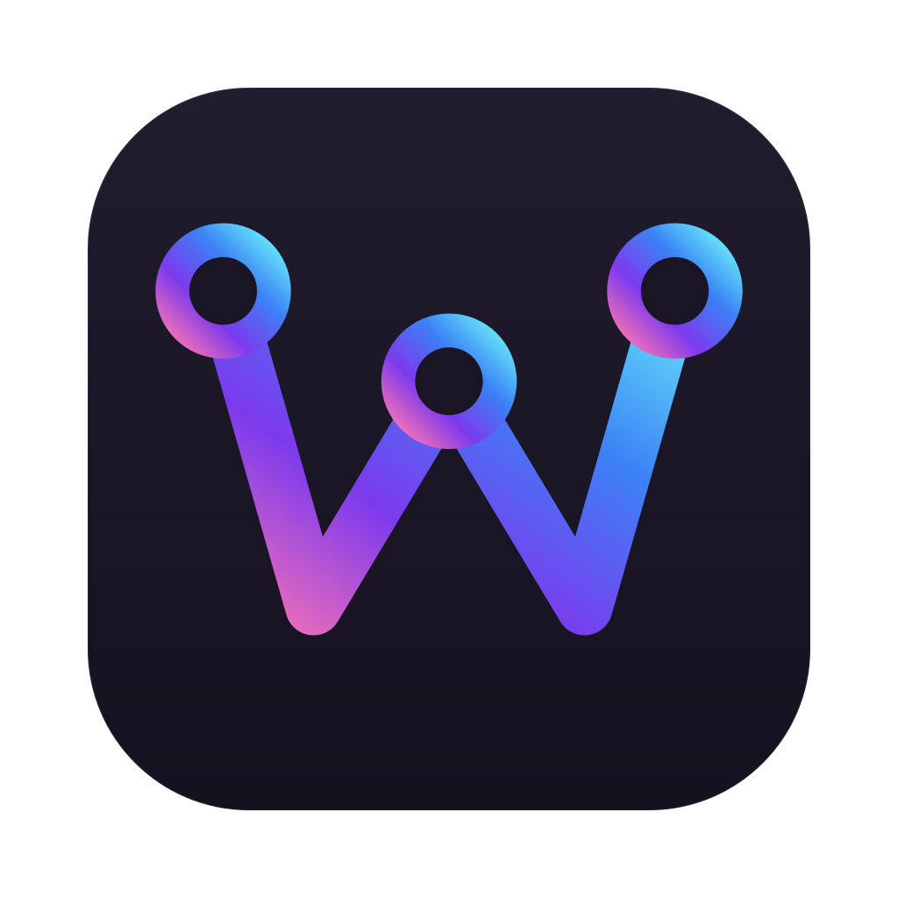
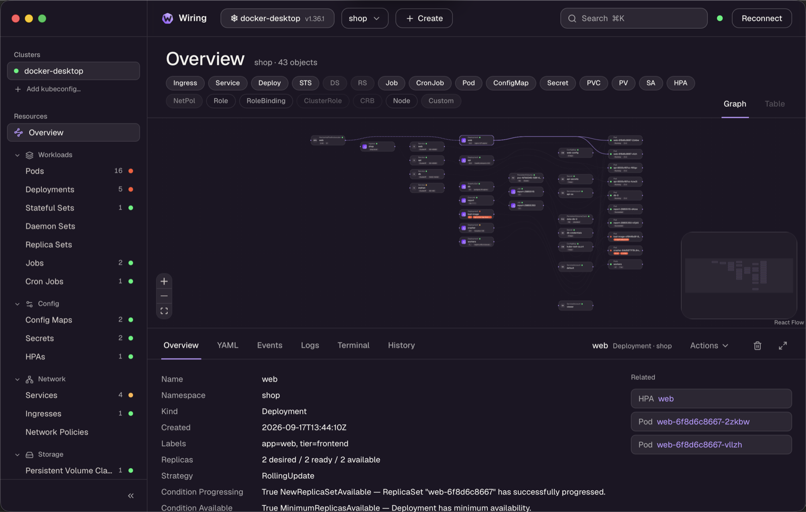
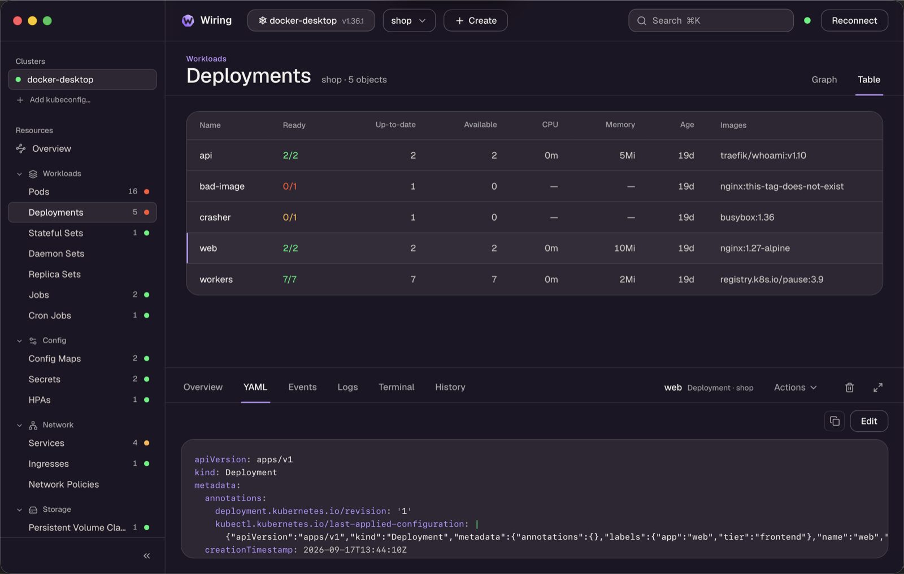
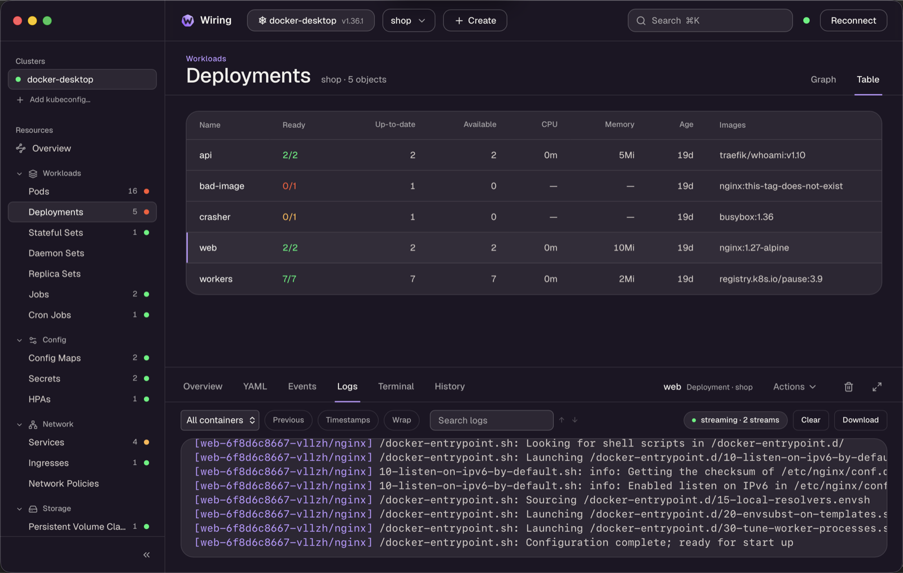

<p align="center">
  
</p>

<h1 align="center">Wiring</h1>

<p align="center">
  A desktop Kubernetes IDE that shows how the resources in a namespace are wired together.
</p>

<p align="center">
  <a href="https://wiringk8s.xyz"><b>Website and documentation</b></a>
</p>

<p align="center">
  <a href="https://github.com/skensell201/wiring/releases/latest"></a>
  <a href="https://github.com/skensell201/wiring/actions/workflows/ci.yml"></a>
  
  <a href="LICENSE"></a>
</p>



<!-- #region overview -->

Wiring's main view is a live graph of a namespace: **Ingress → Service → Deployment → Pod**, plus the ConfigMaps, Secrets, PersistentVolumeClaims, ServiceAccounts and HorizontalPodAutoscalers each workload uses. Select an object to highlight what it is connected to. From the same window you can read and edit its YAML, check its events, stream its logs, open a shell in it and forward a port to it.

It is built with [Tauri 2](https://tauri.app), React and Rust ([kube-rs](https://kube.rs)), and runs on macOS and Windows.

<!-- #endregion overview -->

## Contents

- [Install](#install)
- [Features](#features)
- [Keyboard shortcuts](#keyboard-shortcuts)
- [Try it on a demo cluster](#try-it-on-a-demo-cluster)
- [Development](#development)
- [Project layout](#project-layout)
- [Documentation](#documentation)
- [Releasing](#releasing)
- [License](#license)

## Install

<!-- #region install -->

Download the latest installer from [**Releases**](https://github.com/skensell201/wiring/releases/latest).

| Platform | File | First launch |
|---|---|---|
| macOS (Apple Silicon and Intel) | `Wiring_<version>_universal.dmg` | The build is unsigned. After copying to Applications, run `xattr -d com.apple.quarantine /Applications/Wiring.app`, or right-click the app and choose **Open**. |
| Windows 10/11 | `Wiring_<version>_x64_en-US.msi` or `Wiring_<version>_x64-setup.exe` | The build is unsigned. When SmartScreen appears, choose **More info → Run anyway**. |

<!-- #endregion install -->

<!-- #region kubeconfig -->

Wiring reads your kubeconfig from `~/.kube/config`, or from `KUBECONFIG` when it is set. You can also add a kubeconfig file from inside the app with **Add kubeconfig…**. A file without contexts is refused. If Wiring finds no contexts at all, it opens on a welcome screen. That screen lists each file it looked at and what it found there (not found, can't be read, no contexts), with **Add kubeconfig…** and **Rescan**.

<!-- #endregion kubeconfig -->

### Login helpers

<!-- #region login-helpers -->

Clusters that sign in through a helper program, such as `gke-gcloud-auth-plugin`, `aws` or `kubelogin`, need it installed. On macOS and Linux, Wiring uses your login shell's `PATH`, so it finds a helper installed with Homebrew or a cloud SDK even when you start Wiring from the Dock or a launcher. (When you start Wiring from a terminal, it already has your `PATH`.) Restart Wiring after installing one.

<!-- #endregion login-helpers -->

## Features

### Graph

<!-- #region graph -->

The graph updates live from Kubernetes watches:
- Filter it by kind with the chips under the title, or search it with <kbd>⌘K</kbd> / <kbd>Ctrl+K</kbd>.
- Pods that belong to the same owner collapse into one group. Double-click a group to expand it.
- Status dots and badges show what is healthy, degraded or failing.
- Select a yellow or red object to see why. Overview starts with the reason and the Kubernetes message behind it, followed by the chain of objects that leads to the root cause (for example Deployment → Pod → `ImagePullBackOff`). The same chain is highlighted on the graph.
- NetworkPolicies show which pods they apply to and which pods they let in. Turn on the RBAC chips to see which Roles a ServiceAccount gets through which bindings, and the Node chip to see where each pod runs. A NotReady node is the cause of the pods stuck on it.

<!-- #endregion graph -->

### Navigator

<!-- #region navigator -->

The left sidebar lists every kubeconfig context and the resources of the selected namespace by category: Workloads, Config, Network (with Network Policies), Storage, Access Control (Service Accounts, Roles and Role Bindings, Cluster Roles and Cluster Role Bindings) and Cluster (Nodes), followed by Custom Resources and Helm. Each kind shows a live count and the worst status among its objects. The sidebar collapses to an icon rail.

<!-- #endregion navigator -->

<!-- #region rbac -->

Kinds your RBAC role cannot read are struck through instead of failing.

<!-- #endregion rbac -->

### Empty and error states

<!-- #region empty-states -->

When Wiring has nothing to show, the centre pane says why and offers the next step:
- While connecting, the pane and the header show which cluster Wiring is dialling; **Cancel** stops it.
- A failed connection names the cause, with **Retry** and **Choose another cluster**. The cause is one of: the cluster can't be reached, its certificate isn't trusted, the cluster didn't accept your credentials, a login helper isn't installed (with how to install it) or can't be run, or the cluster didn't answer within 20 seconds.
- A namespace with no objects, a namespace you have no access to (RBAC), every kind hidden by the chips, and a search with no matches each get their own message and button. When there are too many objects to draw, the graph switches to tables and says so.
- Tables of kinds you can read in only some namespaces say so above the rows.
- While some resources can't be watched, the header reads *Reconnecting…*.

<!-- #endregion empty-states -->

### Several namespaces

<!-- #region namespaces -->

The namespace picker in the header takes one namespace (click its name), several (tick them, then **Apply**) or **All namespaces**. With more than one, the graph shows a lane per namespace, tables get a Namespace column, and the navigator counts across all of them. Up to 20 namespaces can be selected at once. Objects keep their own namespace for details, editing, logs, the terminal and actions; **+ Create** has a namespace select. A selection with more than 1,500 objects is shown as tables only. *All namespaces* needs permission to list and watch cluster-wide. A kind your role cannot list that way is watched per namespace and marked *partial*.

<!-- #endregion namespaces -->

### Tables

<!-- #region tables -->

Click a kind to open a `kubectl get`-style table:
- Sort by any column, and filter with the search box.
- Move between rows with <kbd>↑</kbd>/<kbd>↓</kbd>.
- Double-click a row, or press <kbd>Enter</kbd>, to jump to the object in the graph.



<!-- #endregion tables -->

### Custom resources

<!-- #region custom-resources -->

The navigator's **Custom Resources** section lists the API groups of the custom resource kinds the cluster's CRDs define, whether or not your role can list their objects. If you can't read CRDs, it falls back to API discovery and shows the kinds you can list instead, which may include kinds served by aggregated API servers; built-in groups such as `metrics.k8s.io` are never shown. Groups start collapsed; expand one to see its kinds (for example `cert-manager.io` → Certificate). The refresh button re-runs discovery. Click a kind to open a table of its objects in the selected namespaces, with the columns `kubectl get` shows for that kind, and Age. A kind's count appears once its table has been opened. The table updates live while it is open. Its details panel has **Overview** (including the status conditions), **YAML** with the same edit, diff and apply flow as built-in kinds, and **Events**. Custom resources are not watched for the graph, but one that owns a watched object (a Certificate owning a Secret, a Rollout owning ReplicaSets) appears there as its owner. Toggle those nodes with the *Custom* chip. **+ Create** starts from a minimal manifest of the kind, and if access is lost while a table is open it shows the reason with **Retry**.

<!-- #endregion custom-resources -->

### Helm

<!-- #region helm -->

The **Helm** section opens its own view: a table of the releases in the selected namespaces, read from Helm 3's release Secrets, with chart and version, app version, revision, status and when it was last deployed. The list follows changes live, such as new revisions and status changes. Select a release to see its tabs below the table: **Overview**, the user-supplied **Values**, the **History** of stored revisions, the chart's **Notes**, and the **Resources** it installed that exist in the cluster; opening one of those shows it in the details panel. Its objects are highlighted on the graph, whose header reads `Release web highlighted · Clear`. Closing the release, **Clear** or switching namespaces removes the highlight. Wiring reads releases only: it never installs, upgrades or rolls back. Values can contain credentials, so Wiring never logs them. Helm's release Secrets are left out of the graph and the Secrets table. **Show Helm storage** in the Secrets table reveals them.

<!-- #endregion helm -->

### Details panel

<!-- #region details-panel -->

The panel shows **Overview**, **YAML** and **Events** tabs for the selected object, plus **Logs** and **Terminal** for pods and workloads, and **History** for Deployments, StatefulSets and DaemonSets. Drag its top edge to resize it (or focus the edge and use <kbd>↑</kbd>/<kbd>↓</kbd>). Maximise it with ⤢ and restore it with <kbd>Esc</kbd>.

<!-- #endregion details-panel -->

### Editing

<!-- #region editing -->

1. **Edit** on the YAML tab opens the object in an editor.
2. **Save** (<kbd>⌘S</kbd> / <kbd>Ctrl+S</kbd>) shows a line diff of what will be sent.
3. **Apply** replaces the object on the server with strict field validation, so unknown fields are rejected rather than silently dropped.

If the object changed on the server while you were editing, you can **Reload** (drop your edits) or **Overwrite** (resend on top of the new version). Server validation errors appear inline.

**+ Create** in the header starts from a template for any watched kind. The trash icon in the details panel deletes an object after confirmation. On a pod group it deletes every member pod, and the controller recreates them.

<!-- #endregion editing -->

### Rollout actions

<!-- #region actions -->

**Actions ▾** in the details panel, or a right-click on a graph node or a table row, opens the actions for the object:
- **Scale…** (Deployments, StatefulSets) sets the replica count. When a HorizontalPodAutoscaler manages the workload, the dialog warns that it will override the value.
- **Restart** (Deployments, StatefulSets, DaemonSets) replaces the pods the way `kubectl rollout restart` does.
- **Rollback…** opens the **History** tab. Pick a revision to see its pod template diff, then roll back to it.

While a rollout runs, the node shows `rolling updated/desired`. A Deployment that misses its progress deadline turns red, and Overview shows why.

<!-- #endregion actions -->

### Port-forward

<!-- #region port-forward -->

**Port-forward…** in the Actions menu (Pods, Services, Deployments, StatefulSets, DaemonSets) forwards a local port on `127.0.0.1` to the object. Pick one of its ports. The local port defaults to the same number when it is free. A Service or workload forward follows ready pods, so it keeps working through restarts and rollouts. The **⇄** button in the header lists the running forwards, with **Open** (in the browser), **Copy** and **Stop**. Forwards stop when you switch cluster or disconnect.

<!-- #endregion port-forward -->

### Logs

<!-- #region logs -->

Pods and workloads (Deployment, StatefulSet, DaemonSet, Job, CronJob and pod groups) get a **Logs** tab:
- It shows the last 500 lines of each container and then follows live output.
- A workload's pods are merged into one view, each line prefixed with a coloured `[pod/container]` tag.
- You can pick a container, switch to the previous run of a crashing container, and toggle server timestamps and line wrapping.
- Search with match stepping, clear the view, or download the log to a file.
- ANSI colours are rendered.



<!-- #endregion logs -->

### Terminal

<!-- #region terminal -->

Pods and workloads (Deployment, StatefulSet, DaemonSet, Job and pod groups) get a **Terminal** tab. Pick the pod and container, then **Connect** to open a shell in it (`bash` when the image has it, otherwise `sh`). It is a full terminal, with colours, cursor keys, resizing with the panel, and copy with ⌘C / Ctrl+Shift+C. The terminal keeps Tab for the shell; press Ctrl+Shift+Tab to move focus back to the toolbar. The session ends with `exit`, **Disconnect**, or when you select something else. Images without a shell (distroless) say so.

<!-- #endregion terminal -->

### Metrics

<!-- #region metrics -->

When the cluster runs metrics-server, the Pod, Deployment, StatefulSet and DaemonSet tables get CPU and Memory columns in `kubectl top` style (a workload sums its pods), and Overview shows usage against the summed requests and limits. A pod or workload at 80 % or more of a CPU or memory limit gets a `cpu 85%` / `mem 92%` badge on the graph. Usage is sampled every 15 s and never changes an object's status. Without metrics-server, or without access to pod metrics, Overview says so.

<!-- #endregion metrics -->

### Updates

<!-- #region updates -->

Wiring checks for a new release 10 seconds after launch and every 6 hours; on macOS you can also check from **Wiring → Check for Updates…**. When one is available, the header shows **Update X.Y.Z**. Its dialog shows the release notes, with **Install and restart** or **Later**.

<!-- #endregion updates -->

## Keyboard shortcuts

<!-- #region shortcuts -->

| Keys | Action |
|---|---|
| <kbd>⌘K</kbd> / <kbd>Ctrl+K</kbd> | Focus the search box |
| <kbd>⌘S</kbd> / <kbd>Ctrl+S</kbd> | While editing YAML, review the diff |
| <kbd>Esc</kbd> | Close the innermost layer: a menu or dialog, then the maximised details panel, then the diff review, then the editor, then the selection |
| <kbd>↑</kbd> / <kbd>↓</kbd>, <kbd>Enter</kbd> | In a table, move between rows; jump to the object in the graph |
| <kbd>↑</kbd> / <kbd>↓</kbd> on the panel's top edge | Resize the details panel |
| <kbd>Enter</kbd> / <kbd>Shift+Enter</kbd> | In the log search, next / previous match |
| <kbd>⌘C</kbd> / <kbd>Ctrl+Shift+C</kbd> | In the terminal, copy the selection |
| <kbd>Ctrl+Shift+Tab</kbd> | Move focus out of the terminal |

<!-- #endregion shortcuts -->

## Try it on a demo cluster

<!-- #region demo -->

`examples/demo/setup.sh` works against any local cluster (Docker Desktop, kind, minikube). It deploys:
- two namespaces, `shop` and `blog`, including deliberately broken workloads (an image that cannot be pulled, a container that crashes on start);
- the `wiring-viewer` and `wiring-auditor` RBAC identities, with matching restricted kubeconfig contexts, so you can see how Wiring handles kinds a role cannot read.

```bash
examples/demo/setup.sh                 # uses the docker-desktop context
examples/demo/setup.sh kind-kind       # or name another context
examples/demo/setup.sh --with-metrics  # also install metrics-server (flag and context can be combined, in any order)
```

`--with-metrics` applies the official metrics-server manifest and adds `--kubelet-insecure-tls` (once; re-running is safe), which local clusters need. It makes the CPU and Memory columns and the Overview usage rows show data; without metrics-server they stay empty.

The manifests are in [`examples/demo/`](examples/demo/): [`shop.yaml`](examples/demo/shop.yaml), [`blog.yaml`](examples/demo/blog.yaml) and [`rbac.yaml`](examples/demo/rbac.yaml).

<!-- #endregion demo -->

## Development

<!-- #region development -->

Prerequisites: Rust stable, Node 22, pnpm 9, and a kubeconfig with at least one context. On Linux, also install the [Tauri system dependencies](https://tauri.app/start/prerequisites/).

```bash
pnpm install
pnpm tauri dev          # run the app with hot reload
```

Checks (CI runs all of them on every push):

```bash
pnpm typecheck
pnpm test                                    # frontend unit tests (Vitest)
cd src-tauri
cargo fmt --check
cargo clippy --all-targets -- -D warnings
cargo test                                   # backend unit and IPC contract tests

# Needs a live cluster and kubectl:
WIRING_SMOKE_CONTEXT=docker-desktop cargo test --test smoke -- --ignored
```

### Documentation site

The site at wiringk8s.xyz is a VitePress project in [`site/`](site/). Run these from the repository root:

```bash
pnpm site:dev     # live preview
pnpm site:test    # site unit tests
pnpm site:build   # production build into site/.vitepress/dist
```

The landing page is generated from the design mockup by `python3 site/scripts/port-landing.py` (run from the repository root). Never edit the generated `Landing*.vue` files or `landing.css` by hand; change the mockup and rerun the script. To compare the built landing with the mockup in headless Chrome, run `pnpm -C site preview` (it serves on port 4173), then `node site/scripts/check-landing.mjs` from the repository root. Set `SITE` to use another address. Deploy with `site/deploy.sh`.

<!-- #endregion development -->

## Project layout

<!-- #region project-layout -->

```text
src/                     React frontend
  app/                   store (zustand), startup, event wiring, global keys
  features/
    cluster/             header, namespace picker
    onboarding/          welcome, connecting and connection-failure panes
    navigator/           sidebar: clusters, the resource tree, Custom Resources, Helm
    graph/               React Flow canvas, nodes, edges, layout, kind chips
    table/               per-kind and custom resource tables
    details/             details panel: Overview, YAML, Events, History
    editor/              YAML editor, diff review, Create dialog
    actions/             Actions menu, Scale and Restart dialogs
    logs/                Logs tab, virtualised log view, ANSI rendering
    exec/                Terminal tab (xterm.js)
    forward/             Port-forward dialog, running-forwards popover
    helm/                Helm releases view
    update/              update checks, Update pill and dialog
  shared/                IPC types and commands, UI primitives, empty states
  styles/theme.css       design tokens (colours, type, radii)
src-tauri/               Rust backend
  src/commands.rs        the IPC commands
  src/session/           per-context watches, reducer, writes, rollouts, metrics polling
  src/store/             in-memory object cache
  src/graph/             graph model, relations, status, table rows
  src/logs/              log sessions, stream targets, pumps
  src/exec/              shell sessions
  src/forward/           port-forwards
  src/metrics/           metrics-server quantities and usage
  src/custom/            custom resource ids, tables and requests
  src/discovery.rs       custom resource kinds the cluster serves
  src/helm.rs            Helm releases from their storage Secrets
  src/kubeconfig.rs      context discovery
  src/shell_path.rs      login shell PATH for kubeconfig exec plugins
  src/updates.rs         self-update and the macOS menu
  tests/                 IPC contract tests, live smoke test
examples/demo/           demo namespaces and RBAC for a local cluster
docs/                    design specs, plans, IPC contract, release docs
```

<!-- #endregion project-layout -->

## Documentation

<!-- #region design-docs -->

| Document | What it covers |
|---|---|
| [IPC contract](docs/ipc-contract.md) | The backend ↔ frontend commands, events and payload shapes |
| [MVP design](docs/superpowers/specs/2026-09-17-wiring-mvp-design.md) | Architecture, the graph model, relations and status rules |
| [Navigator and tables design](docs/superpowers/specs/2026-09-18-navigator-tables-design.md) | The sidebar, per-kind tables and RBAC handling |
| [YAML editing design](docs/superpowers/specs/2026-09-18-yaml-editing-design.md) | Edit, diff, apply, conflicts, Create and Delete |
| [Pod logs design](docs/superpowers/specs/2026-09-21-pod-logs-design.md) | Log sessions, merging, previous runs and the log view |
| [Problem explanation design](docs/superpowers/specs/2026-10-05-problem-explain-design.md) | Problem reasons, messages and the cause chain |
| [Workload actions design](docs/superpowers/specs/2026-10-05-workload-actions-design.md) | Scale, restart, rollout history and rollback |
| [Port-forward design](docs/superpowers/specs/2026-10-05-port-forward-design.md) | Forward targets, pod selection and the forwards list |
| [Metrics design](docs/superpowers/specs/2026-10-05-metrics-design.md) | metrics-server polling, usage columns and badges |
| [Updater design](docs/superpowers/specs/2026-10-05-updater-design.md) | Update checks, the feed and installing |
| [Graph extras design](docs/superpowers/specs/2026-10-06-graph-extras-design.md) | NetworkPolicies, RBAC and Nodes on the graph |
| [Multi-namespace design](docs/superpowers/specs/2026-10-06-multi-namespace-design.md) | Namespace scopes, lanes and partial kinds |
| [Exec terminal design](docs/superpowers/specs/2026-10-06-exec-terminal-design.md) | Shell sessions and the Terminal tab |
| [Onboarding design](docs/superpowers/specs/2026-10-06-onboarding-design.md) | The welcome screen, connection failures and empty states |
| [Custom resources and Helm design](docs/superpowers/specs/2026-10-06-crds-helm-design.md) | Discovery, the generic table, CR owners on the graph, Helm releases |
| [Code signing](docs/code-signing.md) | Signing and notarizing the macOS and Windows installers in CI |
| [Automatic updates](docs/updates.md) | The updater key and secrets, the update feed, checking a release |

These are the implementation plans behind each feature:
- [backend](docs/superpowers/plans/2026-09-17-wiring-backend.md)
- [frontend](docs/superpowers/plans/2026-09-17-wiring-frontend.md)
- [navigator and tables](docs/superpowers/plans/2026-09-18-navigator-tables.md)
- [YAML editing](docs/superpowers/plans/2026-09-18-yaml-editing.md)
- [pod logs](docs/superpowers/plans/2026-09-21-pod-logs.md)
- [problem explanation](docs/superpowers/plans/2026-10-05-problem-explain.md)
- [workload actions](docs/superpowers/plans/2026-10-05-workload-actions.md)
- [port-forward](docs/superpowers/plans/2026-10-05-port-forward.md)
- [metrics](docs/superpowers/plans/2026-10-05-metrics.md)
- [updater](docs/superpowers/plans/2026-10-05-updater.md)
- [graph extras](docs/superpowers/plans/2026-10-06-graph-extras.md)
- [multi-namespace](docs/superpowers/plans/2026-10-06-multi-namespace.md)
- [exec terminal](docs/superpowers/plans/2026-10-06-exec-terminal.md)
- [onboarding](docs/superpowers/plans/2026-10-06-onboarding.md)
- [custom resources and Helm](docs/superpowers/plans/2026-10-06-crds-helm.md)

<!-- #endregion design-docs -->

## Releasing

<!-- #region releasing -->

To release, push a tag that starts with `v`:

```bash
git tag -a v0.5.1 -m "Wiring v0.5.1"
git push origin v0.5.1
```

The [release workflow](.github/workflows/release.yml) builds a universal macOS `.dmg` and the Windows `.msi` and `.exe` installers, then attaches them to a **draft** GitHub release. Review the draft and publish it. Bump the version in `package.json`, `src-tauri/tauri.conf.json` and `src-tauri/Cargo.toml` before tagging.

After you publish the release, update the version in the landing page's eyebrow: edit `docs/superpowers/specs/2026-10-06-landing-mockup.html`, rerun `python3 site/scripts/port-landing.py`, then publish the site with `site/deploy.sh` (run it with `DRY_RUN=1` first to preview the changes).

The workflow signs and notarizes the macOS app and signs the Windows installers once the signing secrets are configured. Until then it builds unsigned. [Code signing](docs/code-signing.md) explains what to buy and which secrets to set. It also shows how to check a setup with a manual run (`gh workflow run release.yml`), which builds the installers as workflow artifacts without creating a release.

Installed copies update themselves from the latest published release; updates are signed with a separate updater key. [Automatic updates](docs/updates.md) explains the key, the secrets and how to check a release.

<!-- #endregion releasing -->

## License

Wiring is released under the [MIT License](LICENSE).
